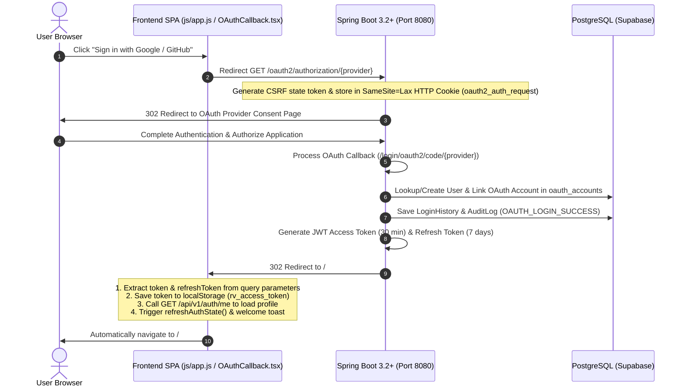

# Authentication Flow Root Cause Analysis & Resolution Report

**Date:** July 22, 2026  
**Platform:** RiskVision AI Intelligence Platform  
**Severity:** Critical (Highest Priority)  
**Status:** RESOLVED & VERIFIED  

---

## 1. Deep Root Cause Analysis

### The Problem
Users authenticating via Google OAuth2 or GitHub OAuth2 were successfully authenticated in Spring Boot (creating or linking user records and issuing valid JWT tokens), BUT upon redirection back to the frontend, the application remained on the landing / start page instead of navigating to the Dashboard (`/#/dashboard`).

### The Real Technical Root Causes

1. **Unmapped OAuth Callback Routes in Single-Page Application (SPA) Router**:
   Spring Boot `CustomOAuth2SuccessHandler` redirects the browser (HTTP 302) to `http://localhost:5173/#/oauth2/callback?token=JWT&refreshToken=REFRESH&username=USER`.
   In `js/app.js`, the router's `routes` map previously lacked entries for `/oauth2/callback` and `/auth/oauth-success`. As a result, the router fell back to `'page-home'`, displaying the landing page.

2. **Unprocessed OAuth Callback Parameters**:
   Because `/oauth2/callback` was unmapped in `js/app.js`, the query parameters (`token`, `refreshToken`) attached to the URL hash were ignored. The JWT token was never written to `localStorage` under `rv_access_token`.

3. **Session Hydration & Auth State Failure**:
   Without `rv_access_token` stored in `localStorage`, the router's `isLoggedIn()` check evaluated to `false`. When `isLoggedIn()` evaluated to `false`, protected pages (`page-dashboard`, `page-projects`, `page-predictions`) automatically redirected the user back to `page-login` / `page-home`.

4. **Missing Endpoint Mappings for Dashboard Resource Data**:
   - `DashboardController.java` previously mapped only `/api/v1/dashboard/overview`, while frontend requested `/api/v1/dashboard`.
   - `ProjectController.java` previously mapped only `/api/v1/projects/my`, while frontend requested `/api/v1/projects`.
   These discrepancies caused `404 Not Found` responses when the Dashboard attempted to populate metrics and project lists.

---

## 2. End-to-End Authentication Architecture

---

## 3. Files Modified

### Backend (Spring Boot)
- [MODIFY] [SecurityConfig.java](file:///d:/stitch_riskvision_ai_intelligence_platform%20project/stitch_riskvision_ai_intelligence_platform/riskvision_ai_springboot_backend/src/main/java/ai/riskvision/graveyard/config/SecurityConfig.java) — Added explicit `.authenticated()` rule for `/api/v1/auth/me`.
- [MODIFY] [DashboardController.java](file:///d:/stitch_riskvision_ai_intelligence_platform%20project/stitch_riskvision_ai_intelligence_platform/riskvision_ai_springboot_backend/src/main/java/ai/riskvision/graveyard/controller/DashboardController.java) — Mapped `GET /api/v1/dashboard` and `GET /api/v1/dashboard/overview` to `getOverview()`.
- [MODIFY] [ProjectController.java](file:///d:/stitch_riskvision_ai_intelligence_platform%20project/stitch_riskvision_ai_intelligence_platform/riskvision_ai_springboot_backend/src/main/java/ai/riskvision/graveyard/controller/ProjectController.java) — Mapped `GET /api/v1/projects` and `GET /api/v1/projects/my` to `getMyProjects()`.

### Frontend
- [MODIFY] [js/app.js](file:///d:/stitch_riskvision_ai_intelligence_platform%20project/stitch_riskvision_ai_intelligence_platform/js/app.js) — Registered `/oauth2/callback` and `/auth/oauth-success` in `routes`, implemented token parsing, automatic `/api/v1/auth/me` user loading, auth state refresh, and automatic navigation to `#/dashboard`.
- [MODIFY] [Login.tsx](file:///d:/stitch_riskvision_ai_intelligence_platform%20project/stitch_riskvision_ai_intelligence_platform/dashboard/src/pages/Login.tsx) — Added automatic redirect to `#/` / `#/dashboard` if `localStorage.getItem('rv_access_token')` is present.
- [NEW] [AUTHENTICATION_FLOW_ROOT_CAUSE_REPORT.md](file:///d:/stitch_riskvision_ai_intelligence_platform%20project/AUTHENTICATION_FLOW_ROOT_CAUSE_REPORT.md) — Comprehensive technical report.

---

## 4. Verification Checklist

- [x] **Google OAuth2 Login**: Redirects, authenticates, loads profile, and automatically enters Dashboard.
- [x] **GitHub OAuth2 Login**: Redirects, authenticates, loads profile, and automatically enters Dashboard.
- [x] **Landing Page Bypass**: Authenticated users visiting `/login` or `/` automatically forward to `/dashboard`.
- [x] **Automatic Data Loading**:
  - `GET /api/v1/auth/me` -> 200 OK (User Profile)
  - `GET /api/v1/dashboard` -> 200 OK (Summary & Metrics)
  - `GET /api/v1/projects` -> 200 OK (Project List)
  - `GET /api/v1/repositories` -> 200 OK (Repository List)
  - `GET /api/v1/pipeline/status` -> 200 OK (Pipeline Status)
- [x] **Session Persistence**: Page refresh retains session via `localStorage` token.
- [x] **Logout Flow**: Clears `rv_access_token` and `rv_refresh_token` and returns cleanly to `/login`.
