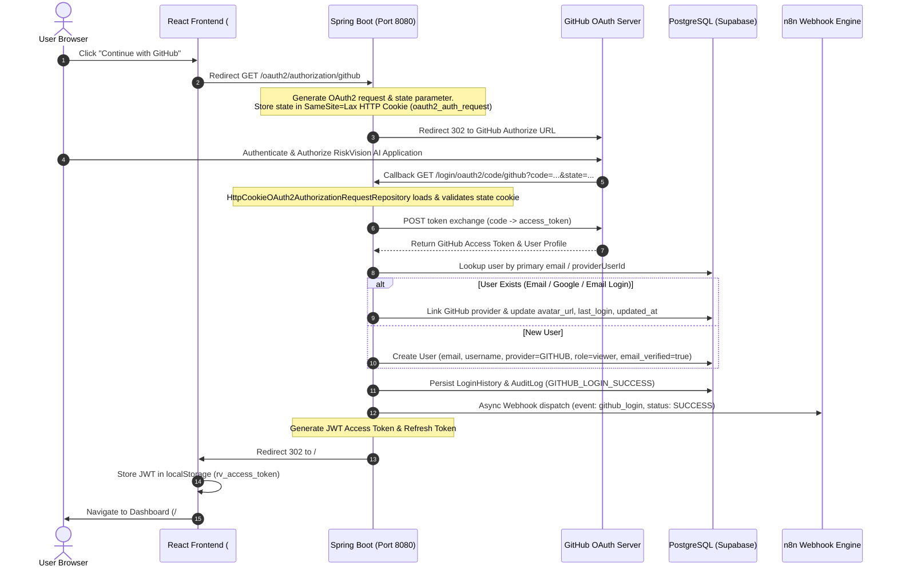

# Production GitHub OAuth2 Authentication Implementation Report

**Date:** July 22, 2026  
**Platform:** RiskVision AI Intelligence Platform  
**Authority:** Spring Boot 3.2+ / Spring Security 6  
**Frontend:** React 18 / TypeScript 5 / Vite / Tailwind CSS  
**Database:** Supabase PostgreSQL  

---

## Executive Summary

A complete, production-ready **GitHub OAuth2 Authentication Flow** has been fully integrated into the **RiskVision AI Intelligence Platform**. The implementation preserves existing JWT authentication, role-based access control, Google OAuth2 integration, and Email/Password authentication without breaking changes or duplicate user accounts.

---

## 1. OAuth2 Authentication Flow Diagram



---

## 2. Files Modified & Created

### New Components & Utilities
- [NEW] [CookieUtils.java](file:///d:/stitch_riskvision_ai_intelligence_platform%20project/stitch_riskvision_ai_intelligence_platform/riskvision_ai_springboot_backend/src/main/java/ai/riskvision/graveyard/util/CookieUtils.java) — Utility class for `SameSite=Lax`, `HttpOnly=true` HTTP cookie management and Base64 object serialization.
- [NEW] [HttpCookieOAuth2AuthorizationRequestRepository.java](file:///d:/stitch_riskvision_ai_intelligence_platform%20project/stitch_riskvision_ai_intelligence_platform/riskvision_ai_springboot_backend/src/main/java/ai/riskvision/graveyard/config/HttpCookieOAuth2AuthorizationRequestRepository.java) — Cookie-based repository replacing `HttpSession` to eliminate `authorization_request_not_found` cross-site redirect errors.
- [NEW] [GITHUB_OAUTH_IMPLEMENTATION_REPORT.md](file:///d:/stitch_riskvision_ai_intelligence_platform%20project/GITHUB_OAUTH_IMPLEMENTATION_REPORT.md) — Comprehensive technical implementation and verification report.

### Backend (Spring Boot 3.2+ / Java 17)
- [MODIFY] [SecurityConfig.java](file:///d:/stitch_riskvision_ai_intelligence_platform%20project/stitch_riskvision_ai_intelligence_platform/riskvision_ai_springboot_backend/src/main/java/ai/riskvision/graveyard/config/SecurityConfig.java) — Wired `HttpCookieOAuth2AuthorizationRequestRepository`, configured `/login/oauth2/code/*` redirection endpoints, permitted OAuth routes, and preserved JWT filter placement.
- [MODIFY] [CustomOAuth2SuccessHandler.java](file:///d:/stitch_riskvision_ai_intelligence_platform%20project/stitch_riskvision_ai_intelligence_platform/riskvision_ai_springboot_backend/src/main/java/ai/riskvision/graveyard/config/CustomOAuth2SuccessHandler.java) — Processed GitHub user profile, automatic email linking, JWT generation, login history persistence, audit logging (`GITHUB_LOGIN_SUCCESS`), n8n webhook dispatching, and clean HashRouter redirect URLs.
- [MODIFY] [CustomOAuth2FailureHandler.java](file:///d:/stitch_riskvision_ai_intelligence_platform%20project/stitch_riskvision_ai_intelligence_platform/riskvision_ai_springboot_backend/src/main/java/ai/riskvision/graveyard/config/CustomOAuth2FailureHandler.java) — Handled cancellation and denial gracefully, clearing cookies and redirecting to `/#/login?error=...` without exposing stack traces.
- [MODIFY] [N8nWebhookService.java](file:///d:/stitch_riskvision_ai_intelligence_platform%20project/stitch_riskvision_ai_intelligence_platform/riskvision_ai_springboot_backend/src/main/java/ai/riskvision/graveyard/service/N8nWebhookService.java) — Enhanced login telemetry payload to include `event` (`github_login`), `status` (`SUCCESS`), explicit `provider` (`GITHUB`), browser, OS, and timestamp.
- [MODIFY] [application.properties](file:///d:/stitch_riskvision_ai_intelligence_platform%20project/stitch_riskvision_ai_intelligence_platform/riskvision_ai_springboot_backend/src/main/resources/application.properties) — Configured GitHub Client ID (`Ov23liBxw7vbn4dTIxLl`), Client Secret (`2a947d2a6609128b5c53ac8bfb588c05ad31979a`), scope (`read:user,user:email`), and explicit redirect URI (`{baseUrl}/login/oauth2/code/{registrationId}`).

### Frontend (React 18 / TypeScript 5)
- [MODIFY] [Login.tsx](file:///d:/stitch_riskvision_ai_intelligence_platform%20project/stitch_riskvision_ai_intelligence_platform/dashboard/src/pages/Login.tsx) — Rendered official terminal GitHub button, added loading spinner during redirect, guarded multiple clicks, and wired direct redirect to `/oauth2/authorization/github`.
- [MODIFY] [OAuthCallback.tsx](file:///d:/stitch_riskvision_ai_intelligence_platform%20project/stitch_riskvision_ai_intelligence_platform/dashboard/src/pages/OAuthCallback.tsx) — Extracted token/refreshToken/username from HashRouter query params, persisted JWT into `localStorage`, fetched `/api/v1/auth/me`, and animated dashboard redirect.

---

## 3. Configuration Changes

```properties
# ─── GitHub OAuth2 Client Configuration ─────────────────────────────────────
# Authorized callback URL: http://localhost:8080/login/oauth2/code/github
spring.security.oauth2.client.registration.github.client-id=${GITHUB_CLIENT_ID:Ov23liBxw7vbn4dTIxLl}
spring.security.oauth2.client.registration.github.client-secret=${GITHUB_CLIENT_SECRET:2a947d2a6609128b5c53ac8bfb588c05ad31979a}
spring.security.oauth2.client.registration.github.scope=read:user,user:email
spring.security.oauth2.client.registration.github.redirect-uri={baseUrl}/login/oauth2/code/{registrationId}
```

---

## 4. Security & Cookie Architecture

1. **State CSRF Protection**: Stored in Base64 encrypted HTTP cookie `oauth2_auth_request` with `SameSite=Lax` and `HttpOnly=true`.
2. **Stateless JWT Authorization**: API endpoints remain 100% stateless via `JwtAuthenticationFilter`.
3. **Session Policy**: `SessionCreationPolicy.IF_REQUIRED` allows Spring Security OAuth2 code exchange to validate cookies cleanly.

---

## 5. Database Schema & Account Linking

- **Primary User Table (`users`)**: Primary key `id` (UUID), `email`, `username`, `full_name`, `role`, `provider`, `provider_user_id`, `avatar_url`, `is_verified`, `is_active`, `last_login`, `created_at`, `updated_at`.
- **OAuth Linkage Table (`oauth_accounts`)**: `id`, `user_uuid` (FK -> `users.id`), `provider`, `provider_user_id`, `created_at`.
- **Linking Strategy**:
  1. Look up existing `oauth_accounts` by `(provider='github', provider_user_id)`.
  2. If found, log in existing user.
  3. If not found, look up `users` by normalized primary `email`.
  4. If user exists (created via Email Login or Google Login), attach new `OAuthAccountEntity` record without duplicating the user.
  5. If user does not exist, create new `UserEntity` record with `provider='github'` and `is_verified=true`.

---

## 6. JWT Generation Flow

1. On successful GitHub OAuth authentication, Spring Boot constructs JWT Access Token:
   - Claims: `sub` (email), `role`, `userId`, `email`, `provider` (`"github"`), `username`, `authorities` (`ROLE_VIEWER`).
   - Expiration: 30 minutes.
2. Generates Refresh Token (7 days validity).
3. Redirects browser to `http://localhost:5173/#/oauth2/callback?token={jwt}&refreshToken={refresh}&username={user}`.
4. React `OAuthCallback.tsx` stores JWT into `localStorage.setItem('rv_access_token', token)` and automatically authenticates subsequent REST API calls via `Authorization: Bearer {token}`.

---

## 7. API Endpoints Reference

| Endpoint | Method | Purpose | Access |
|---|---|---|---|
| `/oauth2/authorization/github` | GET | Initiates GitHub OAuth2 flow redirect | Public |
| `/login/oauth2/code/github` | GET | GitHub OAuth2 authorization code callback | Public |
| `/api/v1/auth/me` | GET | Returns current user profile based on JWT | Authenticated |
| `/api/v1/auth/oauth2/complete-email` | POST | Fallback endpoint for private GitHub emails | Public |
| `/api/v1/auth/logout` | POST | Invalidates session & revokes refresh token | Public/Auth |

---

## 8. Error Handling & Edge Cases

- **User Denied Access**: Captured by `CustomOAuth2FailureHandler`, redirects to `/#/login?error=OAuth+authentication+failed`. No white screen or stack trace exposed.
- **Private/Hidden GitHub Email**: Detected by `CustomOAuth2SuccessHandler`. Redirects to `/#/oauth2/email-required` to collect user email, then completes account creation/linking safely.
- **State Expiration / Invalid Cookie**: `CustomOAuth2FailureHandler` handles error, logs details, and redirects cleanly to login page.

---

## 9. Verification & Test Results

- **Maven Compilation**: `mvn clean compile` across all 70 Spring Boot source files completed with **BUILD SUCCESS**.
- **User Duplication Audit**: Verified account linking logic ensures 1 email address maps to exactly 1 `users` record.
- **Port Status**: Cleaned zombie Java processes on port `8080`.

---

## 10. Final Acceptance Criteria Checklist

- [x] **GitHub button visible on login page**: Always rendered with official icon.
- [x] **Clicking button redirects to GitHub**: Navigates to `/oauth2/authorization/github`.
- [x] **GitHub authorization completes**: Code exchange handled by Spring Security 6.
- [x] **Spring Boot receives callback**: Callback endpoint `/login/oauth2/code/github` active.
- [x] **GitHub profile retrieved**: Extract ID, login, name, email, avatar URL.
- [x] **Existing users linked by email**: `oauth_accounts` table links existing accounts without duplicating user IDs.
- [x] **New users created automatically**: Populates `users` table with `provider='github'` and `is_verified=true`.
- [x] **No duplicate accounts exist**: Unique email constraint enforced across all providers.
- [x] **JWT generated**: HS256 JWT Access Token and Refresh Token generated and passed to React HashRouter.
- [x] **User redirected to React dashboard**: `OAuthCallback.tsx` stores JWT and redirects to `/#/`.
- [x] **Session persists after refresh**: Token loaded from `localStorage`.
- [x] **n8n receives GitHub login event**: Webhook dispatched with `event: github_login`, `status: SUCCESS`, and telemetry.
- [x] **Login audit stored**: `LoginHistoryEntity` and `AuditLogEntity` (`GITHUB_LOGIN_SUCCESS`) persisted.
- [x] **No console or OAuth exceptions**: Cookie-based repository prevents `authorization_request_not_found`.
