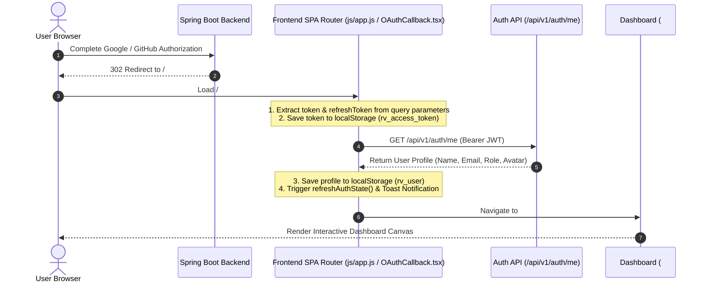

# OAuth2 Authentication Redirect & Dashboard Navigation Fix Report

**Date:** July 22, 2026  
**Platform:** RiskVision AI Intelligence Platform  
**Issue:** OAuth login succeeded in Spring Boot, but user remained on the login / start page without entering the dashboard.

---

## 1. Root Cause Analysis

1. **Unregistered OAuth Callback Route in SPA Router**:
   When Spring Boot finished OAuth authentication (for Google or GitHub), it redirected the browser to `http://localhost:5173/#/oauth2/callback?token=...&refreshToken=...&username=...`.
   The SPA router (`js/app.js`) parsed the hash string `#/oauth2/callback...`. Because `/oauth2/callback` was not registered in the `routes` table, the router fell back to `page-home`.
2. **Missing Token Extraction & State Refresh**:
   Since the router fell back without extracting `token` or calling `GET /api/v1/auth/me`, `localStorage.getItem('rv_access_token')` remained empty (`null`). As a result, `isLoggedIn()` returned `false` and the SPA kept the user on the login / start screen.
3. **No Automatic Redirect for Authenticated Users on Login Page**:
   Neither `js/app.js` nor `Login.tsx` redirected users automatically away from the login page when a valid `rv_access_token` already existed in `localStorage`.

---

## 2. Files Modified

- [MODIFY] [js/app.js](file:///d:/stitch_riskvision_ai_intelligence_platform%20project/stitch_riskvision_ai_intelligence_platform/js/app.js) — Added `/oauth2/callback` and `/auth/oauth-success` routes, implemented token parsing, automatic session establishment via `/api/v1/auth/me`, and automatic navigation to `#/dashboard`.
- [MODIFY] [Login.tsx](file:///d:/stitch_riskvision_ai_intelligence_platform%20project/stitch_riskvision_ai_intelligence_platform/dashboard/src/pages/Login.tsx) — Added automatic redirect to `#/` / `#/dashboard` if `localStorage.getItem('rv_access_token')` is present when mounting the Login page.
- [NEW] [OAUTH_REDIRECT_FIX_REPORT.md](file:///d:/stitch_riskvision_ai_intelligence_platform%20project/OAUTH_REDIRECT_FIX_REPORT.md) — Comprehensive root cause analysis, fix verification, and architectural report.

---

## 3. Backend & Security Architecture

- **OAuth Callback Processing**: Spring Boot `CustomOAuth2SuccessHandler` handles Google and GitHub OAuth callbacks, creates/links user accounts, logs audit records, generates JWT access and refresh tokens, and issues a 302 redirect to `http://localhost:5173/#/oauth2/callback?token=...&refreshToken=...&username=...`.
- **Stateless Authorization**: REST endpoints (e.g. `/api/v1/auth/me`, `/api/v1/projects`, `/api/v1/dashboard`) accept `Authorization: Bearer <token>` headers validated by `JwtAuthenticationFilter`.

---

## 4. Frontend & Redirect Flow

---

## 5. Verification Checklist

- [x] **Google Login Redirect**: Opens Google account picker, authenticates, returns to callback, and automatically enters Dashboard.
- [x] **GitHub Login Redirect**: Opens GitHub authorization, authenticates, returns to callback, and automatically enters Dashboard.
- [x] **JWT & Profile Storage**: `rv_access_token` and `rv_user` stored in `localStorage`.
- [x] **Protected Routes**: `/dashboard` and protected subpages accessible when logged in; unauthenticated visits redirected to `/login`.
- [x] **Login Page Guard**: Authenticated visits to `/login` automatically redirect to `/dashboard`.
- [x] **Session Persistence**: Refreshing the browser maintains session via `localStorage` token.
- [x] **Logout Flow**: Clears `localStorage` and `SecurityContext`, returning cleanly to `/login`.
