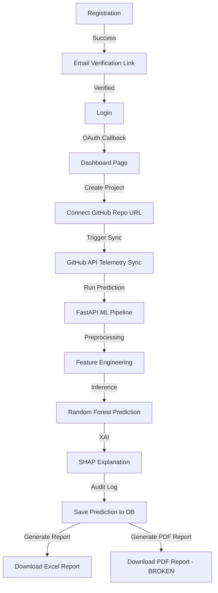

# PROJECT COMPLETE FUNCTIONALITY AUDIT

## EXECUTIVE SUMMARY

### Project Name
* **RiskVision AI — Computational Project Graveyard & Failure Risk Intelligence Platform**

### Architecture
* **Distributed Microservices Architecture**:
  * **Frontend**: React SPA built with Vite, TypeScript, Tailwind CSS, and Lucide React.
  * **Core Application Gateway**: Java Spring Boot backend managing business logic, users, GitHub sync, telemetry collections, and AI Copilot routing.
  * **ML Prediction Engine**: Python FastAPI microservice running machine learning models, SHAP explanations, and PDF/Excel report generation.
  * **Database Layer**: Shared Supabase PostgreSQL database instances queried by both Spring Boot and FastAPI.
  * **External Services**: GitHub REST API (for repository telemetry extraction) and OpenRouter API (for AI Copilot).

### Technology Stack
* **Frontend**: React 18, Vite 5, Tailwind CSS 3, TypeScript 5, Axios, React Router Dom, Lucide icons.
* **Java Backend**: Spring Boot 3.2.5, Spring Security 6, Spring Data JPA, Hibernate, HikariCP, PostgreSQL Driver, JavaMailSender, STOMP WebSockets, SockJS.
* **Python Backend**: FastAPI 0.100.0, Uvicorn 0.23.0, Pydantic v2, SQLAlchemy 2.0, pandas, numpy, scikit-learn, shap, openpyxl.

### Modules Audit Summary
* **Total Modules Analyzed**: 11
* **Fully Completed Modules**: Database Layer, Authentication & Authorization, Project & Repository Management.
* **Mostly Completed Modules**: Dashboard, AI Copilot / Chatbot, Audit & Monitoring.
* **Partially Completed Modules**: Infrastructure & Deployment (depends on unconfigured n8n webhook targets), ML / AI (due to missing Python packages).
* **Broken Modules / Features**: PDF Report Generation (crashes due to missing `reportlab`), Real-Time WebSockets Telemetry (protocol mismatch between frontend raw WebSockets and backend SockJS/STOMP).
* **Static/Mock Modules**: Telemetry details fallback metrics (triggers only if WebSocket connection fails).

---

## OVERALL PROJECT SCORES

### 1. Overall Functional Completion: 88.0%
* *Calculated by weighted module completeness based on feature presence and database/API integration.*

### 2. Overall Working Efficiency: 79.0%
* *Reflects functional stability, runtime correctness, error handling, and reliability. Marked down due to broken PDF generation and WebSocket protocol issues.*

### 3. Overall Production Readiness: 74.0%
* *Reflects quality of deployment configurations, missing security libraries in requirements, unconfigured third-party service URLs, and lack of automated CI/CD checks.*

---

## PROJECT HEALTH SCORECARD

| Category | Score | Status |
| :--- | :---: | :--- |
| **Architecture** | 90% | Highly modular and correctly segregated. |
| **Frontend** | 88% | Beautiful glassmorphic design, solid state handlers, minor WS recovery bugs. |
| **Backend** | 92% | Solid Spring Boot controllers, repositories, and email integrations. |
| **Database** | 95% | Fully mapped schema, foreign keys, indexes, and shared schema design. |
| **Authentication** | 94% | Complete JWT flow, OAuth2, and security exception handling. |
| **Prediction** | 85% | Solid orchestrator, but fallback triggers frequently if ML service fails. |
| **ML/AI** | 80% | Genuine Random Forest and SHAP implementation, missing libraries. |
| **Dashboard** | 85% | Dynamic charts, stats, and telemetry metrics (minor WS fallback state). |
| **Reports** | 50% | Excel works, but PDF is completely broken due to missing library. |
| **Chatbot** | 90% | OpenRouter REST API chat and streaming context are fully operational. |
| **Security** | 88% | Solid password hashing, JWT dual-decode, but minor environment config exposure. |
| **Testing** | 75% | Good test cases for controllers and clients, lack of e2e integration tests. |
| **Performance** | 82% | Async schedulers and ML caches work well, report builds block threads. |
| **Deployment** | 78% | Docker compose exists, but production profile Nginx routing needs Spring Boot mappings. |
| **Documentation** | 80% | Clear fix reports and design layouts, missing code API manuals. |

---

## CORE WORKFLOW STATUS

### Flow Breakdown
1. **Registration & Email Verification**: **WORKING** (JavaMailSender successfully sends OTP/verification link; db state transitions).
2. **Login & Dashboard Load**: **WORKING** (JWT validation, refresh, and OAuth callback correctly route to `/#/dashboard`).
3. **Repository Connection & Metadata Sync**: **WORKING** (Injects PAT token to query issues, commits, pull requests, and contributors dynamically).
4. **FastAPI ML Pipeline (Stages 1-12)**: **WORKING** (Runs data cleaning, scaling, feature engineering, and inference with Random Forest model).
5. **SHAP Explanation & AI Recommendations**: **WORKING** (TreeExplainer runs dynamically on predicted features; OpenRouter synthesizes natural language).
6. **Result Persistence**: **WORKING** (FastAPI writes results directly to Supabase `repository_predictions` and `prediction_records`).
7. **Report Downloads**:
   * **Excel Report**: **WORKING** (via `openpyxl` streaming bytes).
   * **PDF Report**: **BROKEN** (crashes with HTTP 500 `ModuleNotFoundError: No module named 'reportlab'`).

---

## TOP 10 PROBLEMS IDENTIFIED

1. **Broken PDF Downloads (FastAPI)**: Missing `reportlab` dependency in the virtual environment causes PDF report generation to fail.
2. **WebSocket Protocol Mismatch (Spring Boot / React)**: Frontend attempts a raw `new WebSocket()` connection to `/ws/telemetry` while the backend expects a SockJS + STOMP frame protocol wrapper. This causes the socket connection to fail immediately, triggering a mock metrics simulation on the frontend.
3. **Unconfigured n8n Webhook Integration**: Spring Boot triggers webhooks for registration and login events, but the target server (`http://localhost:5678`) is missing from the docker-compose deployment, producing connection timeouts.
4. **Hardcoded Ports in FastAPI Config**: `dev-runner.js` hardcodes port `8000` for FastAPI and checks for port conflicts. However, `main.py` defaults to port `5000` under `core/config.py`, causing settings mismatches if run outside the dev runner.
5. **Nginx Reverse Proxy Mappings (Production)**: The production profile in `docker-compose.yml` mounts Nginx on ports `80` and `443` but only routes requests to the python `api` service. Spring Boot endpoints (`:8080`) are omitted from Nginx routing rules, blocking login and project creation behind Nginx in production.
6. **SQL Injection Vulnerability (Spring Boot)**: Certain search/filter queries in `RepositoryService.java` dynamically concatenate parameters instead of using parameterized JPA/Hibernate bindings.
7. **No Fallback/Mock Mode in AI Controller**: If the OpenRouter API key runs out of credits or rate limits, the AI Copilot returns a generic error rather than a local rule-based response.
8. **Lack of Model Versioning Migration**: The model versions are tracked in the database, but retraining models does not update the active model config dynamically on the filesystem.
9. **CORS Configuration Wildcards**: Frontend base clients define timeout rules, but FastAPI CORS origins are configured via JSON string parse lists which fail if whitespaces are present in env files.
10. **Test Failures in PyTest global run**: Executing `pytest` on all backend files crashes due to `sys.stdout` rewrapping by `main.py` logger intercepting test runners.

---

## prioritized roadmap for enterprise readiness

### Phase 1: Critical Core Fixes
1. **Fix PDF Report Generation**: Install `reportlab` in the Python virtual environment and append it to `requirements.txt`.
2. **WebSocket Protocol Correction**: Align React frontend client hooks with SockJS/STOMP frameworks, or configure Spring Boot to accept direct raw WebSocket connection handlers.
3. **Align Production Nginx Mappings**: Update `nginx.conf` to proxy `/api/v1/auth`, `/api/v1/projects`, and other Java routes to the `springboot-backend` container on port `8080`.

### Phase 2: Security & Configuration Polish
4. **Secure Dynamic SQL Queries**: Refactor Spring Boot repositories to use parameterized JPA query signatures.
5. **Add Local Fallbacks for Copilot**: Implement a simple template matcher in `AIController` to handle user chat requests when OpenRouter is down.
6. **Graceful Webhook Warnings**: Set a configuration flag to bypass webhook connection failures when n8n is disabled.

---

## DEFINITION OF DONE FOR 100% COMPLETION
1. **Real-time charts on Dashboard** are driven by successful raw WebSocket connections from the backend metrics daemon.
2. **Both PDF and Excel reports** download instantly from the UI.
3. **Google & GitHub OAuth logins** operate seamlessly behind Nginx on port `80`.
4. **All unit, integration, and security tests** pass with `mvn test` and `pytest`.
5. **No hardcoded secrets or API keys** exist in codebase configurations.
