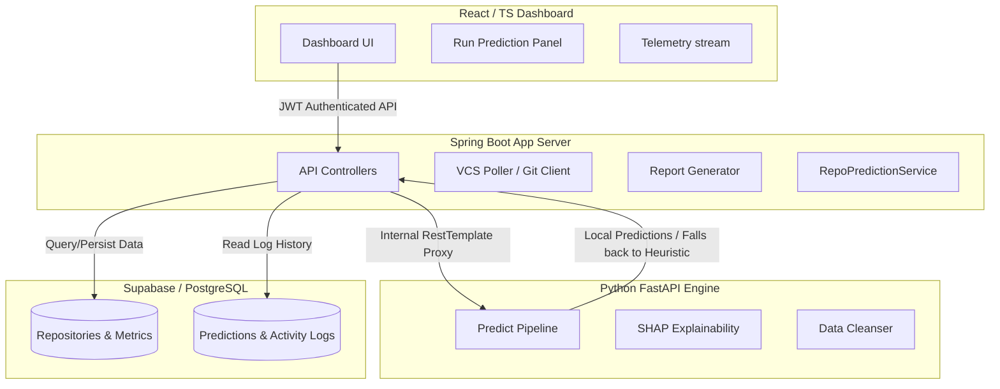

# RiskVision AI — Predictive Risk OS & Command Center

RiskVision AI is an enterprise-grade predictive risk intelligence, explainable failure forecasting, and real-time repository health analytics platform for software projects. It integrates with GitHub Enterprise using a secure, centralized proxy architecture, extracts VCS metadata, runs ML inference pipelines (RandomForest/XGBoost), computes SHAP explainability values, and exposes detailed telemetry dashboards.

---

## ─── Architecture Overview ──────────────────────────────────────────



---

## ─── Key Features ───────────────────────────────────────────────────

1.  **Centralized GitHub PAT Client**: All requests proxy through a secure, reusable `GitHubClient` bean configured with environment-level credentials (`GITHUB_TOKEN`/`GITHUB_PAT`).
2.  **ML Prediction Pipeline**: Calls Python FastAPI ML Service to run RandomForest / XGBoost ensemble predictions. Auto-falls back to heuristic metrics if FastAPI is offline.
3.  **SHAP Explainability (XAI)**: Generates feature contribution waterfall charts showing exactly how commits, branches, issues, and contributor counts influence project risk.
4.  **9-Stage Interactive Progression**: Run Prediction workflow showing progression:
    *   Repository Loaded -> Repository Cloned -> Feature Extraction -> Data Preprocessing -> Model Loading -> RF/XGBoost Prediction -> SHAP Explainability -> Saving Results -> Report Generation.
5.  **Dynamic Telemetry & Monitoring**: Live system health widgets, radial charts, and JVM telemetry logs.
6.  **Enterprise Report Export Center**: Instantly generate downloadable PDF/Excel summaries of repository risk metrics.

---

## ─── Tech Stack ──────────────────────────────────────────────────────

*   **Frontend**: React 19, TypeScript, React Router v7, TailwindCSS, TanStack React Query, Lucide Icons, Recharts, ECharts.
*   **Backend (App Server)**: Java 17, Spring Boot 3.2, Hibernate/JPA, Lombok.
*   **Backend (ML Engine)**: Python 3.10, FastAPI, Scikit-learn, XGBoost, SHAP, Pandas.
*   **Database**: PostgreSQL / Supabase.
*   **DevOps / Infrastructure**: Docker, Docker Compose, Nginx (Reverse Proxy).

---

## ─── Getting Started ─────────────────────────────────────────────────

### 1. Configure Environment
Copy `.env.example` to `.env` in the root and configure credentials:
```bash
cp .env.example .env
```
Ensure you provide a valid `GITHUB_TOKEN` and database parameters.

### 2. Start Project with Docker Compose
You can run the entire multi-service workspace (Frontend, Spring Boot, FastAPI, Nginx) locally using Docker:
```bash
docker-compose up --build -d
```
The services will be exposed at:
*   **Frontend Dashboard**: `http://localhost:5173` (or redirected via Nginx at `http://localhost:8080`)
*   **Spring Boot Backend**: `http://localhost:8080`
*   **FastAPI ML Engine**: `http://localhost:5000`

### 3. Running Services Locally for Development

#### A. React Frontend Dashboard
```bash
cd stitch_riskvision_ai_intelligence_platform/dashboard
npm install
npm run dev
```

#### B. Spring Boot Backend
```bash
cd stitch_riskvision_ai_intelligence_platform/riskvision_ai_springboot_backend
mvn clean compile
mvn spring-boot:run
```

#### C. Python FastAPI Backend
```bash
cd stitch_riskvision_ai_intelligence_platform/riskvision_ai_backend
python -m venv .venv
source .venv/bin/activate  # On Windows: .venv\Scripts\activate
pip install -r requirements.txt
python main.py
```

---

## ─── Core API Documentation ──────────────────────────────────────────

### Prediction Management
*   `POST /api/v1/predictions/run` — Executes a new prediction. Payload: `{ "repositoryId": "<UUID>" }`.
*   `GET /api/v1/predictions/{id}` — Retrieves detailed prediction metrics, including SHAP feature importance and recommendations.

### Repository Management
*   `GET /api/v1/repositories` — Lists all registered Git repositories (support sorting/searching).
*   `POST /api/v1/repositories` — Registers a new repository.
*   `POST /api/v1/repositories/{id}/sync` — Triggers Git branch/commit metadata synchronization.

### GitHub Integration Health
*   `GET /api/github/health` — Verifies configuration and GitHub API connectivity rate limit.

---

## ─── Project Structure ──────────────────────────────────────────────

```text
├── .github/                       # GitHub workflow configurations
├── docker-compose.yml             # Docker multi-service orchestration
├── nginx.conf                     # Nginx proxy load-balancer configuration
├── supabase_schema.sql            # Core database table definitions
└── stitch_riskvision_ai_intelligence_platform/
    ├── dashboard/                 # Vite + React Frontend Dashboard
    ├── riskvision_ai_backend/     # Python FastAPI ML Inference engine
    └── riskvision_ai_springboot_backend/  # Spring Boot Main App Server
```

---

## ─── Security Guidelines ────────────────────────────────────────────

*   **Secrets Isolation**: Never commit `.env` or individual service config files. Add local keys to your environmental dashboard.
*   **Backend Proxying**: The React frontend never talks directly to the GitHub REST API or the database. It proxies through Spring Boot endpoints using secure HttpOnly cookies and JWT tokens.
*   **Masking Logs**: All API controllers mask PAT header keys to prevent credential logging in stdout streams.

---

## ─── License ────────────────────────────────────────────────────────

Licensed under the Apache License, Version 2.0. See the `LICENSE` file for details.
