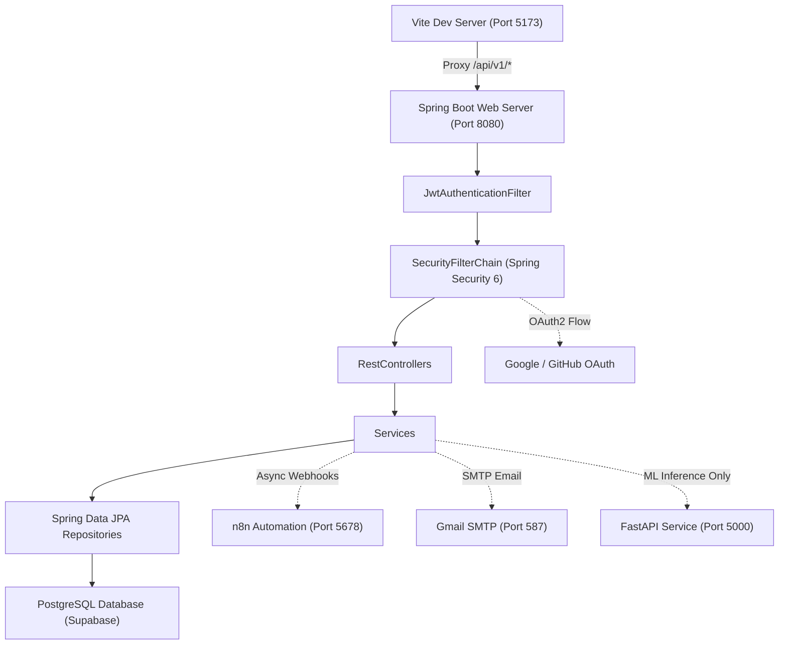

# System Dependency Map — RiskVision AI Intelligence Platform

---

## 1. Frontend Components
- **Dashboard React Application** (`dashboard/src`):
  - `Login.tsx` (`#/login`) — Cyberpunk sign-in card with Email/Password & Google/GitHub OAuth action buttons.
  - `Register.tsx` (`#/register`) — User account registration form with password confirmation.
  - `VerifyEmail.tsx` (`#/verify-email`) — Automated email verification token validator.
  - `ResetPassword.tsx` (`#/password-reset`) — 2-Step 6-digit OTP password reset component with countdown timer & resend button.
  - `Dashboard.tsx` (`#/`) — Primary AI project failure hazard analytics dashboard.
  - `Repositories.tsx` (`#/repositories`) — Monitored SDLC repository management view.
  - `Profile.tsx` (`#/profile`) — User profile, role badges, & connected OAuth accounts.
  - `System.tsx` (`#/system`) — System health & node operational telemetry.
  - `Telemetry.tsx` (`#/telemetry`) — Real-time telemetry log stream.
  - `OAuthCallback.tsx` (`#/oauth2/callback`) — Handles Spring Boot OAuth redirect with JWT parameters.
  - `OAuthEmailRequired.tsx` (`#/oauth2/email-required`) — Fallback email collector for OAuth accounts without public email.

- **Vanilla HTML SPA Application** (`stitch_riskvision_ai_intelligence_platform/index.html`):
  - `page-home` — Landing page with dynamic WebGL aurora shader background.
  - `page-login` — HTML login form with Google & GitHub OAuth buttons.
  - `page-register` — HTML registration form.
  - `page-forgot-password` — HTML 6-digit OTP password reset form.
  - `page-projects`, `page-predictions`, `page-training`, `page-notifications`, `page-profile`, `page-admin`.

---

## 2. API Services
- `dashboard/src/api/client.ts` — Axios base client configured with JWT interceptor & refresh token handler.
- `dashboard/src/api/auth.ts` — Authentication API methods (`login`, `register`, `requestPasswordReset`, `confirmPasswordReset`, `getMe`).
- `dashboard/src/api/dashboard.ts` — Dashboard overview & risk metrics APIs.
- `dashboard/src/api/projects.ts` — Project management APIs.
- `dashboard/src/api/repository.ts` — Repository sync & predictive metrics APIs.
- `stitch_riskvision_ai_intelligence_platform/js/api.js` — Vanilla JS API client fetching `/api/v1` endpoints.

---

## 3. Controllers (Spring Boot 3.2+)
- `AuthController.java` (`/api/v1/auth`) — Authentication, registration, email verification, 6-digit OTP password reset, and refresh token rotation.
- `HealthController.java` (`/api/v1/health`) — System health verification endpoint (`status: UP`, `database: CONNECTED`, `pipeline: RUNNING`).
- `PipelineController.java` (`/api/v1/pipeline`) — Pipeline status telemetry (`/status`, `/metrics`, `/evaluation`).
- `RepositoryController.java` (`/api/v1/repositories`) — Git repository tracking, sync triggers, and analytics.
- `ProjectController.java` (`/api/v1/projects`) — Software project CRUD operations.
- `ProfileController.java` (`/api/v1/profile`) — User profile management & OAuth linkage toggles.
- `DashboardController.java` (`/api/v1/dashboard`) — High-level failure risk summary metrics.

---

## 4. Services (Spring Boot 3.2+)
- `AuthService.java` — Credential validation, BCrypt hashing, JWT token issuance, refresh token rotation, 6-digit OTP handling, and OAuth account linking.
- `CustomUserDetailsService.java` — Loads UserDetails by email/username for Spring Security.
- `PipelineService.java` — Validates database connectivity and compiles neural pipeline metrics.
- `EmailService.java` — Dispatches HTML emails via JavaMailSender (SMTP) with fallback handling.
- `N8nWebhookService.java` — Asynchronously dispatches event webhooks to n8n automation engine.
- `RepositoryService.java` — Manages repository synchronization and metadata.
- `RepositoryAnalyticsService.java` — Computes code churn, commit velocity, and bug density metrics.
- `RepositoryValidationService.java` — Validates repository URL formats and permissions.
- `RepoPredictionService.java` — Communicates with FastAPI ML inference engine.
- `ProjectService.java` — Handles project lifecycle and budget/timeline metrics.
- `DashboardService.java` — Aggregates enterprise risk indicators.

---

## 5. Repositories (Spring Data JPA)
- `UserRepository.java` (`users`)
- `OAuthAccountRepository.java` (`oauth_accounts`)
- `RefreshTokenRepository.java` (`refresh_tokens`)
- `VerificationTokenRepository.java` (`verification_tokens`)
- `LoginHistoryRepository.java` (`login_history`)
- `AuditLogRepository.java` (`audit_logs`)
- `RepositoryEntityRepository.java` (`repositories`)
- `RepositoryMetricsEntityRepository.java` (`repository_metrics`)
- `RepositoryActivityEntityRepository.java` (`repository_activities`)
- `RepositoryPredictionEntityRepository.java` (`repository_predictions`)
- `ProjectRepository.java` (`projects`)
- `PredictionRecordRepository.java` (`prediction_records`)

---

## 6. Entities (Spring Data JPA)
- `UserEntity` (`users` table)
- `OAuthAccountEntity` (`oauth_accounts` table)
- `RefreshTokenEntity` (`refresh_tokens` table)
- `VerificationTokenEntity` (`verification_tokens` table)
- `LoginHistoryEntity` (`login_history` table)
- `AuditLogEntity` (`audit_logs` table)
- `RepositoryEntity` (`repositories` table)
- `RepositoryMetricsEntity` (`repository_metrics` table)
- `RepositoryActivityEntity` (`repository_activities` table)
- `RepositoryPredictionEntity` (`repository_predictions` table)
- `ProjectEntity` (`projects` table)

---

## 7. Database Tables (PostgreSQL / Supabase)
- `users`
- `oauth_accounts`
- `refresh_tokens`
- `verification_tokens`
- `login_history`
- `audit_logs`
- `repositories`
- `repository_metrics`
- `repository_activities`
- `repository_predictions`
- `projects`
- `prediction_records`

---

## 8. External Services
- **n8n Email & Automation Engine** (`http://localhost:5678/webhook/*`):
  - `REGISTRATION_VERIFICATION`, `LOGIN_SUCCESS`, `LOGIN_FAILED_WARNING`, `PASSWORD_RESET_REQUEST`, `PASSWORD_CHANGED`, `ACCOUNT_LOCKED`, `OAUTH_ACCOUNT_LINKED`.
- **Google OAuth 2.0** (`https://accounts.google.com/o/oauth2/v2/auth`):
  - Client ID & Client Secret configured in `application.properties`.
- **GitHub OAuth 2.0** (`https://github.com/login/oauth/authorize`):
  - Client ID & Client Secret configured in `application.properties`.
- **FastAPI ML Inference Service** (`http://localhost:5000`):
  - Pure ML prediction and SHAP explanation endpoints.

---

## 9. Configuration Files
- `riskvision_ai_springboot_backend/src/main/resources/application.properties` — Spring Boot port, database credentials, mail settings, OAuth registration, and log levels.
- `riskvision_ai_springboot_backend/pom.xml` — Dependencies: Spring Boot 3.2.3, Spring Security 6, Spring Data JPA, PostgreSQL, JWT 0.12.5.
- `vite.config.js` (Root) — Port 5173, root path, proxy configuration mapping `/api/v1/*` to `http://localhost:8080`.
- `dashboard/vite.config.ts` — Base `/dashboard/`, proxy configuration mapping `/api/v1/*` to `http://localhost:8080`.
- `package.json` (Root) — Scripts: `"dev": "vite stitch_riskvision_ai_intelligence_platform"`, `"springboot": "mvn spring-boot:run ..."`.

---

## 10. Environment Variables
- `PORT`: Spring Boot server port (Default: 8080).
- `SUPABASE_DB_HOST`, `SUPABASE_DB_PORT`, `SUPABASE_DB_NAME`, `SUPABASE_DB_USER`, `SUPABASE_DB_PASSWORD`: PostgreSQL connection parameters.
- `SECRET_KEY`: Shared HMAC-SHA256 JWT signing secret.
- `MAIL_USERNAME`, `MAIL_PASSWORD`: Gmail SMTP credentials.
- `GOOGLE_CLIENT_ID`, `GOOGLE_CLIENT_SECRET`: Google OAuth2 application credentials.
- `GITHUB_CLIENT_ID`, `GITHUB_CLIENT_SECRET`: GitHub OAuth2 application credentials.
- `FRONTEND_URL`: Public address of Vite frontend (Default: `http://localhost:5173`).
- `N8N_WEBHOOK_BASE_URL`: Webhook engine address (Default: `http://localhost:5678/webhook`).

---

## 11. Application Startup Sequence & Call Tracing

