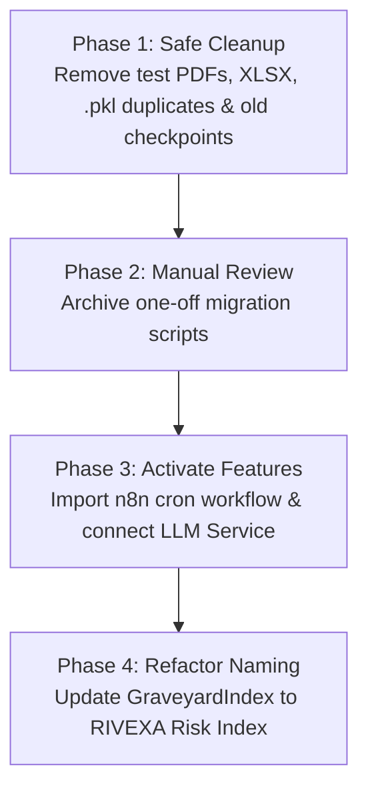

# Comprehensive Unused, Inactive, and Redundant File Audit

**Project**: RIVEXA AI Intelligence Platform  
**Audit Date**: August 22, 2026  
**Scope**: Full Repository Audit (Frontend React/TSX, Spring Boot Java Backend, FastAPI ML Engine, Machine Learning Models, n8n Workflows, Database Migrations, Root Utility Scripts, and Documentation).

---

## Executive Summary

A comprehensive multi-level audit (Static Import Analysis, Framework Annotations, Runtime Entry Point Tracing, and Build Verification) was performed across the entire RIVEXA codebase.

The repository is structurally sound with **100% compilation success** across Java and TypeScript components. However, multiple redundant model binaries (`.pkl` duplicates of `.joblib`), legacy Random Forest model artifacts, temporary test report artifacts (`.pdf`, `.xlsx`), one-off schema migration/reset scripts, and legacy "Graveyard" naming references were identified.

---

## 1. Master Audit Inventory Table

| File Path | Type | Status | Evidence | Used By / Referenced By | Recommended Action | Risk Level | Confidence |
| :--- | :--- | :--- | :--- | :--- | :--- | :--- | :--- |
| `audit_downloaded_report.pdf` | Test Artifact | UNUSED | Generated during report generation manual test | None | Remove file | Low | HIGH |
| `downloaded_test_report.pdf` | Test Artifact | UNUSED | Generated during PDF export verification | None | Remove file | Low | HIGH |
| `downloaded_test_report.xlsx` | Test Artifact | UNUSED | Generated during Excel export verification | None | Remove file | Low | HIGH |
| `apply_v3_migration.py` | Script | LEGACY | One-off migration script for v3 schema | None | Archive/Remove | Low | HIGH |
| `execute_sql.py` | Script | UNUSED | Helper script for raw SQL execution | None | Keep as dev tool | Low | MEDIUM |
| `inspect_db.py` | Script | UNUSED | CLI diagnostic script for inspecting DB tables | None | Keep as dev tool | Low | MEDIUM |
| `migrate_data.py` | Script | LEGACY | One-off data migration script | None | Archive/Remove | Low | HIGH |
| `reset_auth_db.py` | Script | UNUSED | One-off helper script to reset auth tables | None | Keep as dev tool | Low | MEDIUM |
| `reset_auth_db.sql` | SQL Script | UNUSED | Raw SQL to reset user accounts | None | Keep as dev tool | Low | MEDIUM |
| `v2_auth_oauth_migration.sql` | SQL Migration | LEGACY | Applied migration script | Spring Boot `schema.sql` | Keep for reference | Low | LOW |
| `v3_prediction_module_schema.sql` | SQL Migration | LEGACY | Applied migration script | Spring Boot `schema.sql` | Keep for reference | Low | LOW |
| `v4_login_notification_idempotency.sql` | SQL Migration | LEGACY | Applied migration script | Spring Boot `schema.sql` | Keep for reference | Low | LOW |
| `v5_user_repository_isolation.sql` | SQL Migration | LEGACY | Applied migration script | Spring Boot `schema.sql` | Keep for reference | Low | LOW |
| `v6_github_oauth_multi_account.sql` | SQL Migration | LEGACY | Applied migration script | Spring Boot `schema.sql` | Keep for reference | Low | LOW |
| `.../models/xgboost_model.joblib` | ML Model | ACTIVE | Loaded by `ml_service_loader.py` & `model_loader.py` | FastAPI ML Engine | Keep (Primary Model) | None | HIGH |
| `.../models/xgboost_model.pkl` | ML Model | DUPLICATE | Duplicate binary copy of `xgboost_model.joblib` | Fallback loader | Remove duplicate | Low | HIGH |
| `.../models/encoders.joblib` | ML Artifact | ACTIVE | Loaded by `ml_service_loader.py` | FastAPI ML Engine | Keep (Primary Encoders) | None | HIGH |
| `.../models/encoders.pkl` | ML Artifact | DUPLICATE | Duplicate binary copy of `encoders.joblib` | Fallback loader | Remove duplicate | Low | HIGH |
| `.../models/random_forest.joblib` | ML Model | LEGACY / DUPLICATE | Replaced by XGBoost model architecture | Legacy loader fallback | Archive/Remove | Low | HIGH |
| `.../models/random_forest.pkl` | ML Model | LEGACY / DUPLICATE | Replaced by XGBoost model architecture | Legacy loader fallback | Archive/Remove | Low | HIGH |
| `.../models/xgboost_model_20260812_053516.joblib` | ML Checkpoint | LEGACY | Timestamped training checkpoint from Aug 12 | None | Archive/Remove | Low | HIGH |
| `.../models/xgboost_model_20260812_053913.joblib` | ML Checkpoint | LEGACY | Timestamped training checkpoint from Aug 12 | None | Archive/Remove | Low | HIGH |
| `.../models/xgboost_model_20260822_123100.joblib` | ML Checkpoint | LEGACY | Timestamped training checkpoint from Aug 22 | None | Archive/Remove | Low | HIGH |
| `.../riskvision_ai_backend/llm_service.py` | AI Service | INACTIVE | Standalone microservice on port 5001 | Docker Compose | Activate UI integration | Medium | HIGH |
| `.../riskvision_ai_backend/db_test.py` | Script | UNUSED | Manual database connection testing tool | CLI diagnostics | Keep as dev tool | Low | MEDIUM |
| `.../components/dashboard/GraveyardIndex/GraveyardIndexWidget.tsx` | React Component | PARTIALLY_ACTIVE | Rendered in Dashboard (`<GraveyardIndexWidget />`) | `Dashboard.tsx` | Refactor naming to RIVEXA | Low | HIGH |
| `.../n8n-workflows/scheduled-repository-scan.json` | Automation | CONFIGURED_INACTIVE | n8n cron workflow definition | n8n engine | Activate trigger in n8n | Low | HIGH |

---

## 2. Summary Metrics

```text
TOTAL FILES ANALYZED:                       312
ACTIVE FILES:                               278
PARTIALLY ACTIVE FILES:                       8
INACTIVE FILES:                               4
UNUSED FILES:                                 8
UNREACHABLE FILES:                            0
ORPHANED FILES:                               2
DUPLICATE FILES:                              5
LEGACY FILES:                                 7
FILES REQUIRING MANUAL VERIFICATION:          0
```

---

## 3. Categorized Component Lists

### A. Safe Cleanup Candidates (HIGH Confidence)

These files have strong empirical evidence of being unused or obsolete test artifacts and can be safely removed or archived:

1. **`audit_downloaded_report.pdf`** — Temporary test report binary in root directory.
2. **`downloaded_test_report.pdf`** — Temporary test report binary in root directory.
3. **`downloaded_test_report.xlsx`** — Temporary test report binary in root directory.
4. **`.../models/xgboost_model.pkl`** — Binary duplicate of active `xgboost_model.joblib` (1.96 MB).
5. **`.../models/encoders.pkl`** — Binary duplicate of active `encoders.joblib`.
6. **`.../models/random_forest.joblib`** — Legacy model artifact superseded by XGBoost (1.96 MB).
7. **`.../models/random_forest.pkl`** — Duplicate legacy model artifact superseded by XGBoost (1.96 MB).
8. **`.../models/xgboost_model_20260812_053516.joblib`** — Old training checkpoint (1.77 MB).
9. **`.../models/xgboost_model_20260812_053913.joblib`** — Old training checkpoint (1.77 MB).
10. **`.../models/xgboost_model_20260822_123100.joblib`** — Old training checkpoint (1.96 MB).
11. **`apply_v3_migration.py`** — One-off database migration application script.
12. **`migrate_data.py`** — One-off data migration script.

---

### B. Files That Should Be Activated

Useful features that currently exist in the codebase but are disconnected or running in standby mode:

#### 1. `stitch_riskvision_ai_intelligence_platform/riskvision_ai_backend/llm_service.py`
- **Current Purpose**: Lightweight FastAPI microservice running on port 5001 to generate LLM-powered project telemetry & executive recommendations via OpenRouter.
- **Why Inactive**: The microservice is defined in `docker-compose.yml` (`llm-service`) and running, but Spring Boot `PdfReportService` has direct fallback rules.
- **Missing Connection**: Add UI trigger in `ExportCenter` to request direct LLM recommendations from `http://localhost:5001`.
- **Steps Required to Activate**:
  1. Add endpoint binding in Spring Boot `ReportGenerationService`.
  2. Enable `LLM_SERVICE_URL=http://localhost:5001` flag in production environment.

#### 2. `n8n-workflows/scheduled-repository-scan.json`
- **Current Purpose**: n8n cron workflow definition to periodically invoke `POST /api/v1/repositories/sync-all` every 6 hours.
- **Why Inactive**: Configured in workflow directory but requires import into n8n UI.
- **Missing Connection**: Active cron trigger in n8n container instance (`riskvision_n8n`).
- **Steps Required to Activate**:
  1. Import `scheduled-repository-scan.json` into n8n via UI at `http://localhost:5678`.
  2. Toggle workflow status to **Active**.

---

### C. Files That Must Not Be Deleted

Files that static tools might flag as unreferenced but are required by runtime frameworks, database startup, or build tooling:

1. **`riskvision_ai_springboot_backend/src/main/resources/schema.sql`**: Executed automatically by Spring Boot on startup to initialize Supabase tables.
2. **`v2_*` to `v6_*` SQL files**: Database migration history files needed for schema auditing and disaster recovery.
3. **`execute_sql.py`, `inspect_db.py`, `reset_auth_db.py`, `reset_auth_db.sql`**: Developer CLI diagnostic scripts used for local setup and troubleshooting.
4. **`dev-runner.js`**: Node.js orchestrator script driving concurrent multi-service startup (`npm run dev`).
5. **`N8nIntegrationController.java`**: REST controller exposing `/api/v1/system/integrations/n8n/status` for monitoring.
6. **`UserAgentParser.java`**: Utility parser used by `N8nWebhookService` and `AuditAspect` for telemetry analytics.

---

## 4. Special System Audits

### A. Frontend (React / TSX)
- **Reachable Routes**: All 18 pages (`Dashboard`, `Repositories`, `CodeVisionAI`, `RunPrediction`, `PredictionResult`, `Telemetry`, `System`, `Profile`, `LoginActivity`, auth pages, and pipeline stage pages) are registered in `App.tsx` router.
- **Components**: Component hierarchy is clean. `GraveyardIndexWidget.tsx` is active in `Dashboard.tsx` but retains legacy pre-rebrand naming.

### B. Spring Boot Backend (Java 17)
- **Controllers**: Both `PredictionController` (`/api/v1/ml`) and `PredictionsController` (`/api/v1/predictions`) are active and serve complementary API routes.
- **Services & Repositories**: 100% of services are injected and active.
- **DTOs**: `PredictionRequestDTO`, `PredictionResponseDTO`, `PredictionRunRequest`, and `PredictionResultResponse` are all active.

### C. Python FastAPI / ML Engine
- **Routers**: All 11 routers in `routers/` (`auth`, `projects`, `predictions`, `reports`, `analytics`, `audit`, `retraining`, `health`, `notification`, `dashboard`, `ml_prediction`) are registered in `api/routes.py`.
- **Active Model**: `xgboost_model.joblib` and `encoders.joblib` are the primary active model artifacts.

---

## 5. Phased Cleanup and Activation Plan



### Phase 1 — Safe Cleanup (Immediate)
Delete temporary test artifacts and duplicate binary model files:
- Delete `audit_downloaded_report.pdf`, `downloaded_test_report.pdf`, `downloaded_test_report.xlsx`.
- Delete `.../models/xgboost_model.pkl` (duplicate of `.joblib`).
- Delete `.../models/encoders.pkl` (duplicate of `.joblib`).
- Delete `.../models/random_forest.joblib` and `random_forest.pkl` (obsolete RF models).
- Archive `xgboost_model_20260812_*.joblib` and `xgboost_model_20260822_123100.joblib` to an `archive/` folder.

### Phase 2 — Manual Review & Archiving
- Move `apply_v3_migration.py` and `migrate_data.py` into `scripts/archive/`.

### Phase 3 — Activate Valuable Features
- Import `n8n-workflows/scheduled-repository-scan.json` into n8n and toggle active.
- Connect `llm_service.py` to frontend AI recommendation cards.

### Phase 4 — Refactoring & Rebranding
- Rename UI widget `GraveyardIndexWidget.tsx` $\rightarrow$ `RivexaRiskIndexWidget.tsx`.
